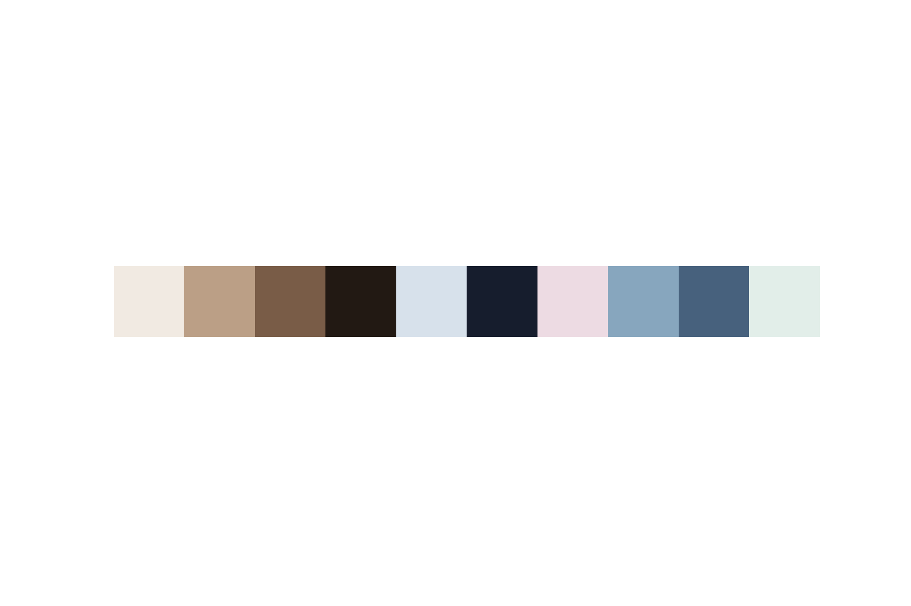
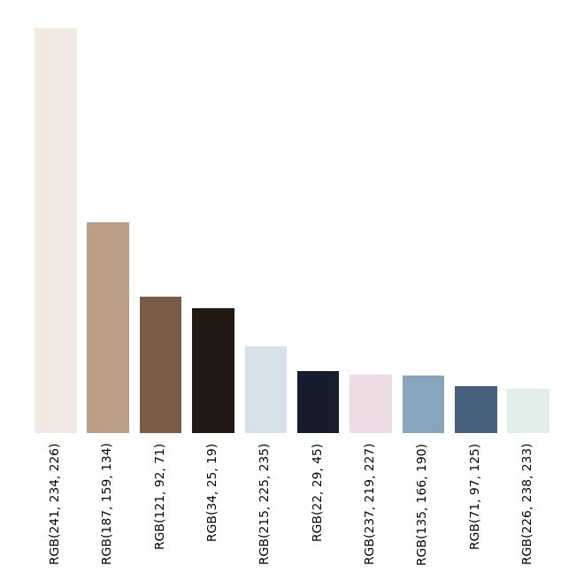

# [`#selfcare`](https://www.instagram.com/explore/tags/selfcare/) 🛀

<h3>Visual analysis of images from Instagram posts with hashtag #selfcare</h3>

<br>

This project aims to analyze high-level visual patterns from Instagram posts tagged with hashtag
[`#selfcare`](https://www.instagram.com/explore/tags/selfcare/).

The code is built using Python and is distributed under [GPL-3.0 License](LICENSE).


### Content

- [Data](#data)
- [Results](#results)
- [Use the code](#use-the-code)


## Data


The experiments have been done using images from Instagram posts with the hashtag `#selfcare`. The images have been retrieved mostly from the following days:

- 2021-01-07
- 2021-01-08
- 2021-01-10

However, other dates are also present. Details on the date occurences can be found in [this file](results/stats_dates.csv).

The created dataset contains **3526 images**.

> [Read more](#prepare-the-dataset) to prepare your dataset.


## Results
### Palette
The following palette was found as the most descriptive for the dataset (10 colours). More details on the colours are
found in [this file](results/palette_rgb_codes.csv).



The following bar plot, illustrates the relevance of each palette component along with the corresponding RGB code.

The higher the bar, the more presence it had in the dataset.



## Use the code
The core code of the project lives in folder [scripts](scripts), where multiple scripts are found. 
### Installation
Make sure to have [python](https://www.python.org/downloads/) installed.

```
$ pip install -r requirements.txt
```

_This project was developed using Python 3.8_

### Prepare the dataset
#### Download images
Use the script [`download_images.py`](scripts/download_images.py). By default, images are stored under `data/original`
(make sure it exists).

```
$ python scripts/download_images.py
```

#### Process images
Use the script [`process_images.py`](scripts/process_images.py). By default, images are stored under `data/processed`
(make sure it exists).

```
$ python scripts/process_images.py
```

This script resizes the images to 224x224 pixels. In order to minimize the impact of resizing (it can lead to noticeable
distortions), only near-squared images have been used.

### Build data collage
Use the script [`build_collage.py`](scripts/build_collage.py).

```
$ python scripts/build_collage.py
```

By default, the generted collage is stored as
[results/collage.jpg](results/collage.jpg).

### Obtain palette
Use the script [`get_palette.py`](scripts/build_collage.py).

```
$ python scripts/get_palette.py
```

This will do the following (by default):
- Obtain a 10-length colour palette and store it as [`results/palette_rgb_codes.csv`](results/palette_rgb_codes.csv).
- Generate the colour palette. Saves image as [`results/palette.png`](results/palette.png)
- Generate the colour palette bar plot, illustrating presence rate. Saves image as [`results/palette_proportion.png`](results/palette_proportion.png)

### Others

#### Some stats (post's date occurence)
Use the script [`get_stats.py`](scripts/get_stats.py).

```
$ python scripts/get_stats.py
```

By default, it saves results as [`results/stats_dates.csv`](results/stats_dates.csv)