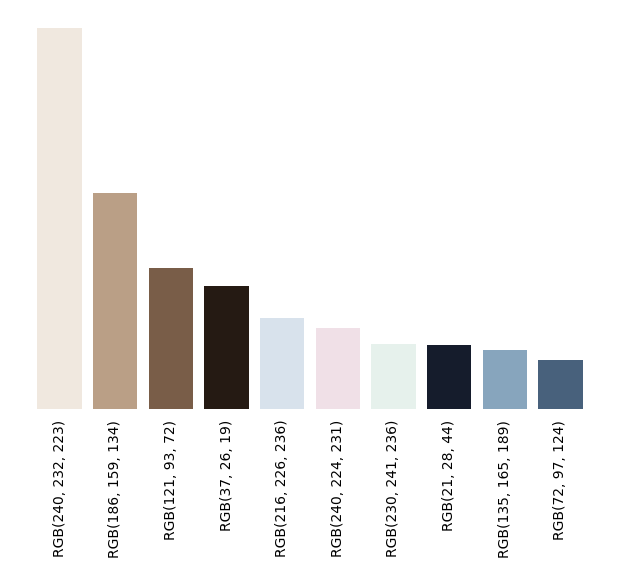
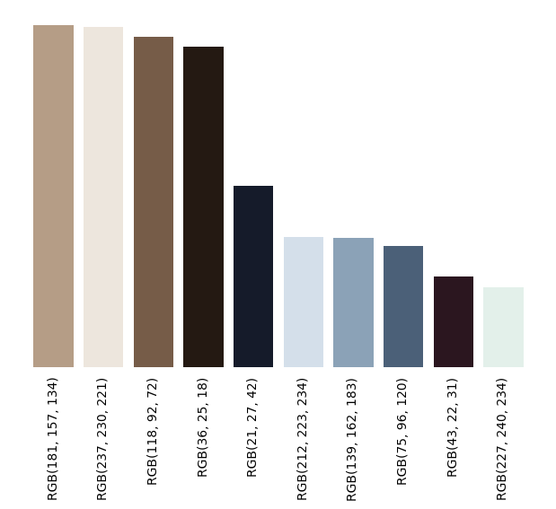

# [`#selfcare`](https://www.instagram.com/explore/tags/selfcare/) 🛀

### Colour analysis of images from Instagram posts with hashtag #selfcare

<br>

This project explores high-level colour patterns present in Instagram posts with hashtag
[`#selfcare`](https://www.instagram.com/explore/tags/selfcare/). To this end, it compares pixel colour values of #selfcare-tagged images and generic images.

The code is built using Python and is distributed under [GPL-3.0 License](LICENSE).

### Content

- [1. Data](#1-data)
- [2. Method](#2-method)
- [3. Results](#3-results)
- [4. Use the code](#4-use-the-code)


## 1. Data


For this experiment, 2 datasets have been created. One containing Instagram images with hashtag #selfcare and the other
containing generic Instagram images. 

> [Read more](#prepare-the-dataset) to prepare your dataset.

### 1.1 `#selfcare` dataset
A total of 3526 images have been retrieved mostly from the following days:

- 2021-01-07
- 2021-01-08
- 2021-01-10

However, other dates are also present. Details on the date occurences can be found in [this file](results/stats_dates.csv).

### 1.2 Generic dataset
A total of 3526 images have been retrieved. There come from different hashtags: `#tbt`, `#followme`, `#repost`, `#photooftheday`,
`#picoftheday`, `#follow`, `#like4like`, `#nature`, `#instagood`, `#instadaily`, `#instagram`, `#happy`. 

We deemed that the images tagged with these 12 hashtags present a wide variety of imagery that may be representative of Instagram as a whole. The hashtags have been obtained from [this list of the most used Instagram hashtags](https://influencermarketinghub.com/most-popular-instagram-hashtags/).

## 2. Method

For both datasets:

* **Download images**: Images are downloaded from Instagram posts with specific hashtags using
  [`instaloader`](https://instaloader.github.io/) package.
* **Process images**: Near-squared images are resized into (100, 100) pixel images. 
* **Build collage**: Build a collage with all (100, 100) processed images. Example [here](results/collage.png).
* **Extract palette**: Finally, the colour palette is extracted from the previously generated collage, leveraging
  [`colorgram.py`](https://github.com/obskyr/colorgram.py) package.

Finally, once results for both datasets are obtained:
* **Comparison**: Palettes obtained from both datasets are compared.
## 3. Results
In the following, results obtained from both datasets are presented.
### 3.1 `#selfcare`
The following palette was found as the most descriptive 10-colours palette for the dataset. More details on the colours
are found in [this file](results/palette_rgb_codes.csv), including their relative importance.


The following bar plot, illustrates the relative share of importance of each palette component along with the corresponding RGB code. The
higher the bar, the more presence it had in the dataset. Precise values can be found [here](results/palette_rgb_codes_jpg).



### 3.2 Generic
Below I illustrate the palette for a generic post in Instagram.




## 4. Use the code
The core code of the project lives in folder [scripts](scripts), where multiple scripts are found. 
### 4.1 Installation
Make sure to have [python](https://www.python.org/downloads/) installed.

```
$ pip install -r requirements.txt
```

_This project was developed using Python 3.8_

### 4.2 Prepare the dataset
#### 4.2.1 Download images
Use the script [`download_images.py`](scripts/download_images.py). By default, images are stored under `data/original`
(make sure it exists).

```
$ python scripts/download_images.py
```

#### 4.2.2 Process images
Use the script [`process_images.py`](scripts/process_images.py). By default, images are stored under `data/processed`
(make sure it exists).

```
$ python scripts/process_images.py
```

This script resizes the images to 224x224 pixels. In order to minimize the impact of resizing (it can lead to noticeable
distortions), only near-squared images have been used.

### 4.2.3 Build data collage
Use the script [`build_collage.py`](scripts/build_collage.py).

```
$ python scripts/build_collage.py
```

By default, the generted collage is stored as
[results/collage.jpg](results/collage.jpg).

### 4.2.4 Obtain palette
Use the script [`get_palette.py`](scripts/build_collage.py).

```
$ python scripts/get_palette.py
```

This will do the following (by default):
- Obtain a 10-length colour palette and store it as [`results/palette_rgb_codes.csv`](results/palette_rgb_codes.csv).
- Generate the colour palette. Saves image as [`results/palette.png`](results/palette.png)
- Generate the colour palette bar plot, illustrating presence rate. Saves image as [`results/palette_proportion.png`](results/palette_proportion.png)

### 4.3 Others

#### 4.3.1 Some stats (post's date occurence)
Use the script [`get_stats.py`](scripts/get_stats.py).

```
$ python scripts/get_stats.py
```

By default, it saves results as [`results/stats_dates.csv`](results/stats_dates.csv)
