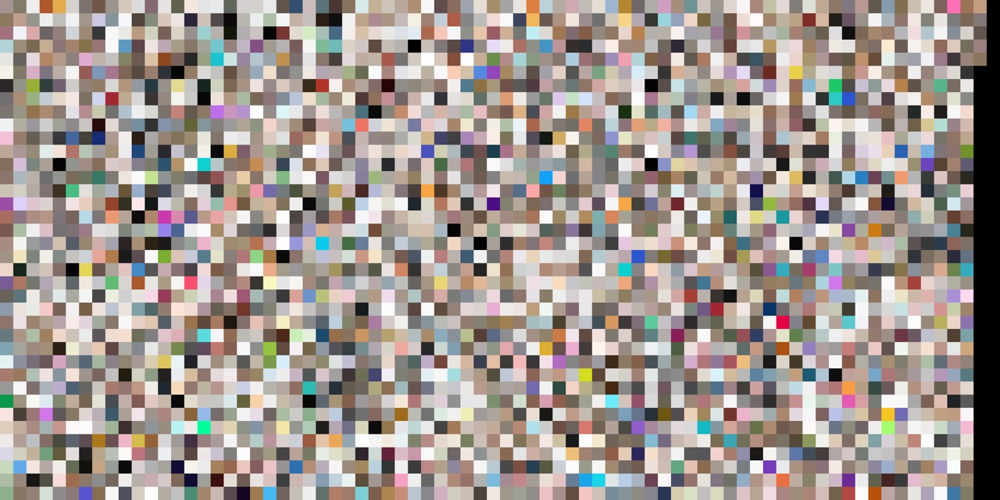

# [`#selfcare`](https://www.instagram.com/explore/tags/selfcare/) 🛀
## Visual analysis of images from Instagram posts with hashtag #selfcare 

Visual analysis of Instagram posts with tag [`#selfcare`](https://www.instagram.com/explore/tags/selfcare/).

### Content

- [Project Overview](#project-overview)
- [Results](#results)
- [Use the code](#use-the-code)

## Project Overview
TODO
## Results
> To recreate the results obtained below, check section [Use the code](#use-the-code).


## Use the code
The core code of the project lives in folder [scripts](scripts).
### Installation
```
$ python setup.py install
```

### Prepare the dataset
#### Download images
```
$ python scripts/download_images.py
```

#### Reshape images
Next, reshape them accordingly (only nearly-squared are preserved.
```
$ python scripts/reshape_images.py
```
